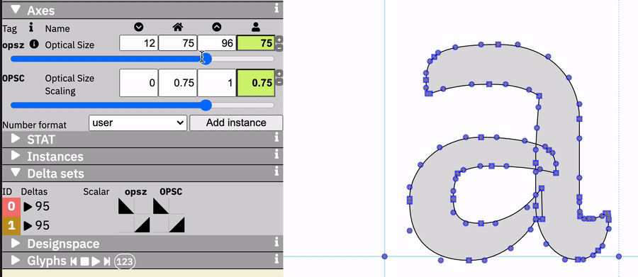

# Overlapping Axis Test

A test of what happens if two axes in a variable font have an overlapping function, as might be the case if Optical Size were controlled by one opsz set to `pt` values and a secondary opsz axis controlled by `px` values.

TL;DR: A variable font can’t have two axes which act in the same way but with different scales. But, there are possibly some interesting results achievable through such a setup.

## General process

This font makes use of the letter `a` from [Recursive](https://github.com/arrowtype/recursive) Mono Casual.

To make the test results obvious, I will be manipulating what is really the weight axis. Specifically, I’m using the Light weight of `a` for a “minimum” and the ExtraBold weight of `a` is used for a “maximum.”

Fonts are built from UFO & Designspace sources using [FontMake](https://github.com/googlefonts/fontmake/). Then, they are tested in [Samsa](https://www.axis-praxis.org/samsa/).

## A simple, two-source test

The simplest test is what happens if a designspace has two axes with different scales, but which both share one source for their min & default, and a second source for their max value.

### Test setup

There are two axes: 
- `XONE`, from 12–96, simulating an opsz in CSS points. Default 12.
- `XTWO`, from 16–128, simulating a redundant opsz axis in CSS px. Default 16.

There are two sources:
- Source 1: `Overlapping Axis Test-A.ufo`
  - `XONE` = `12`
  - `XTWO` = `16`
- Source 2: `Overlapping Axis Test-B.ufo`
  - `XONE` = `96`
  - `XTWO` = `128`

### Hypothesis

I expect the output variable font to have two sets of deltas which would act redundantly, and lead to a maximum-value style which was an extrapolation (extremely bold, in this case).

### Results

The resulting font acts in an way I hadn’t expected. The two axes become interdependent.

1. If either axis is at its minimum, the other axis has no effect. 

2. If either axis is at its maximum, the other axis has the same effect it might have if it were operating on its own. 

3. If either axis is set at a partial value, it allows the other axis to have a corresponding partial effect. 

## A slightly more complex, three-source test

What if we alter the original test setup to add have *three* source references, by duplicating the reference to the second UFO?

### Test setup

In `source/Overlapping Axis Test -- complex.designspace`, I have used the same axes as in the simple test.
- `XONE`, from 12–96, simulating an opsz in CSS points. Default 12.
- `XTWO`, from 16–128, simulating a redundant opsz axis in CSS px. Default 16.

There are three sources (with one repeated master):
- Source 1: `Overlapping Axis Test-A.ufo`
  - `XONE` = `12`
  - `XTWO` = `16`
- Source 2: `Overlapping Axis Test-B.ufo`
  - `XONE` = `96`
  - `XTWO` = `16`
- Source 3: `Overlapping Axis Test-B.ufo`
  - `XONE` = `12`
  - `XTWO` = `128`

### Hypothesis

(This is the same as the first hypothesis.)

I expect the output variable font to have two sets of deltas which would act redundantly, and lead to a maximum-value style which was an extrapolation (extremely bold).

### Results

This approach does confirm the hypothesis.

With this approach:

- There are now two deltas.
- Either axis can make the font go from minimum to maximum on their own delta set.
- If either axis is turned up, increasing the other axis will result in "stacking" of deltas, resulting in an effect of extrapolation.

## Third test: setting one axis to a partial value by default?

Result part 3 of the first test left me with a question: could I create a two-master setup in which the default of one axis is still the minimum, but the default of the other axis is a middle value such as 0.75 of 1.0? This could effectively allow a “scaling” axis.

Another possibility for this idea came up: [might it be possible to have a hidden “power boost” for a weight axis?](https://twitter.com/w__h_/status/1263778563519475713) For example, could a font have a limited weight range by default, but allow users to extend this range by adjusting a secondary axis?

### Test setup

There are two axes: 
- `opsz`, from 12–96, simulating an opsz in CSS points. Default 12
- `OPSC`, from 0–1, simulating a way to scale `opsz`. Default 0.75

There are two sources:
- Source 1: `Overlapping Axis Test-A.ufo`
  - `opsz` = `12`
  - `OPSC` = `0`
- Source 2: `Overlapping Axis Test-B.ufo`
  - `opsz` = `96`
  - `OPSC` = `1`

❌💀❌💀❌

This resulted in a build error: `fontTools.varLib.errors.VarLibValidationError: Base master not found; no master at default location?`. Basically, you *must* have a source at the default value of both axes.

### Test setup, retry

I’ll make a middle master, with a UFO interpolated at 75%:
- Source 1: `Overlapping Axis Test-A.ufo`
  - `opsz` = `12`
  - `OPSC` = `0`
- Source 2: `Overlapping Axis Test-mid_0.75.ufo`
  - `opsz` = `75`
  - `OPSC` = `0.75`
- Source 2: `Overlapping Axis Test-B.ufo`
  - `opsz` = `96`
  - `OPSC` = `1`

### Hypothesis

The `OPSC` axis can act as a scaler of the `opsz` axis. So, if `OPSC` is at 0.75, an `opsz` value of `16` would act as a value of `12`. This can seem logical at first, until you think about it more deeply after seeing the results.

### Results

The results are ... unintuitive and (probably) supremely unuseful. The hypothesis was not supported.

1. If either axis is at its default value of 75%, the other axis has no effect. 

2. If one axis is turned above the default 75%, the other axis will only have an effect above the default. 

3. Similarly, if one axis is turned below the default 75%, the other axis will only have an effect below the default. 

Results 2 & 3 are initially confusing, but both are actually quite similar behavior to the results of the first, simple test above. 

For result 2, both masters have to be above the default value for the other to have an effect above that default. For result 3, the result is the same, but just going in the negative direction.

So, you *could* kind of make a scaling axis – after all, this was achieved in the first, simple test. However, this requires both axes to start at a place in which both must be changed from the default to have any effect. Unfortunately, this seems like it would be very unintuive for users – no browser or user could be expected to know that to use `opsz` they would have to first turn up `OPSC` – and this would essentially break the axis you were trying to scale.

## Conclusion: we need “avar2” for this to work as desired

With current OpenType behavior, it does not seem to be possible to offer two axes that do the same thing but with different scales, without unintended results.

Probably, this behavior would require an addition to OpenType such as the [XVAR proposal](https://github.com/microsoft/OpenType-XVAR-proposal), which is [now being called “avar2.”](https://github.com/w3c/csswg-drafts/issues/4430#issuecomment-632363710) In this proposal, the positioning of one axis would have the ability to specifically alter the mapping of another axis.

Could it still be useful to have two interdependent axes? Possibly, there is some use case for this that is hard to determine. Have an idea of what this might be? Please consider [filing an issue](https://github.com/arrowtype/overlapping-axis-test/issues) in this repo, or forking it and testing for yourself! If you do test yourself, please also file an issue so I can consider linking to your tests from this readme.
