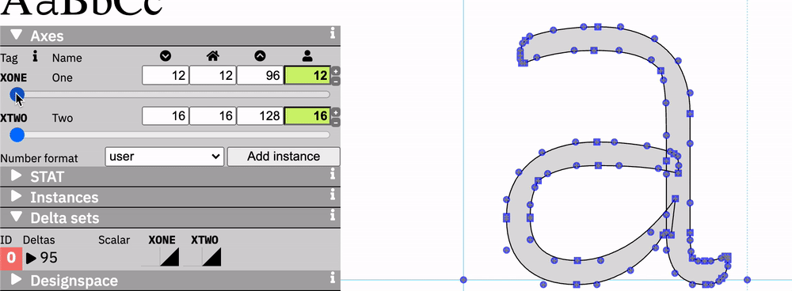
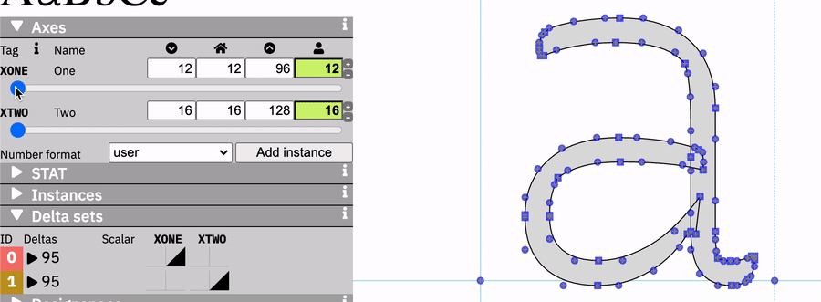

# Overlapping Axis Test

A test of what happens if two axes in a variable font have an overlapping function, as might be the case if Optical Size were controlled by one opsz set to `pt` values and a secondary opsz axis controlled by `px` values.

TL;DR: A variable font cannot have two axes which act in the same way but with different scales.

## Test setup

This font makes use of the letter `a` from [Recursive](https://github.com/arrowtype/recursive) Mono Casual.

The Light weight of `a` is used for an "minimum" while the ExtraBold weight of `a` is used for a "maximum."

There are two axes: 
- `XONE`, from 12–96, simulating an opsz in CSS points
- `XTWO`, from 16–128, simulating a redundant opsz axis in CSS px

Font `A` is given `XONE=12, XTWO=16` while font `B` is given `XONE=16, XTWO=128`.

### Hypothesis

I expected the output variable font to have two sets of deltas which would act redundantly, and lead to a maximum-value style which was an extrapolation (extremely bold, in this case).

## Results from a simple, two-source test

The resulting font acts in an way I hadn’t expected. The two axes become interdependent.

1. If either axis is at its minimum, the other axis has no effect.



2. If either axis is at its maximum, the other axis has the same effect it might have if it were operating on its own.


3. If either axis is set at a partial value, it allows the other axis to have a corresponding partial effect.


## Results from a more complex test

If we alter the original test setup to add have *three* source references, we can achieve the originally-hypothesized result.

In `source/Overlapping Axis Test -- complex.designspace`, I have used the same axes, but given the sources the following structure:

```
source: "Overlapping Axis Test-A.ufo", stylename="A"
    - XONE="12"
    - XTWO = "16"/>

source: "Overlapping Axis Test-B.ufo", stylename="B"
    - XONE = "96"/>
    - XTWO = "16"/>

source: "Overlapping Axis Test-B.ufo", stylename="D"
    - XONE = "12"/>
    - XTWO = "128"/>
```

With this approach:

- there are now two deltas 
- Either axis can make the font go from minimum to maximum on their own delta set
- If either axis is turned up, increasing the other axis will result in "stacking" of deltas, resulting in an effect of extrapolation



## Conclusion

With current OpenType behavior, it is not possible to offer two axes that do the same thing but with different scales, without unintended results.

Probably, this would require an addition to OpenType such as the [XVAR proposal](https://github.com/microsoft/OpenType-XVAR-proposal).

Is it still useful to have two interdependent axes? Possibly, there is some use case for this that is hard to determine. For example, a font might be able to offer one axis for Optical Size, and a secondary axis like a 0–100 "Optical Size Scaling Percentage" axis that could modify the impact of that optical sizing axis.
